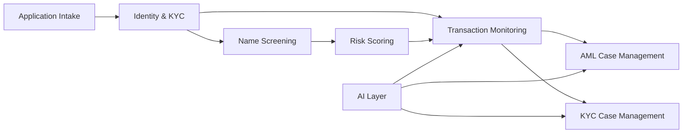
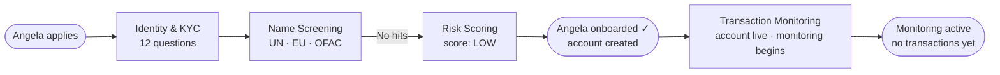
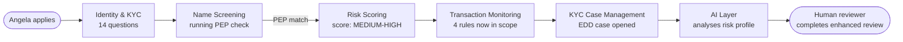
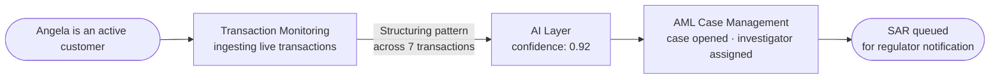
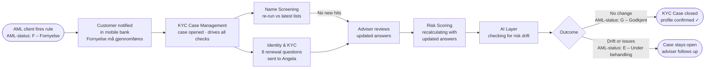

# AML Flow — Spec

Anti-Money Laundering compliance lifecycle for a retail banking customer.
Covers onboarding, ongoing monitoring, and offboarding across four scenarios.

---

## Persona

**Name:** Angela Martins  
**Situation:** New retail banking customer applying for an account  
**Why she matters:** She represents the typical customer journey — most customers
are low-risk and sail through, but the same system must catch the rare bad actor
without creating friction for everyone else.

---

## System nodes

| Node | What it does |
|---|---|
| **Application Intake** | Receives the customer's application and dispatches it into the system |
| **Identity & KYC** | Collects and verifies personal details; dispatches questionnaire to the customer |
| **Name Screening** | Checks the customer's name against UN, EU, and OFAC sanctions lists and PEP registries |
| **Risk Scoring (CRR)** | Calculates a Customer Risk Rating based on identity, source of funds, and behaviour |
| **Transaction Monitoring** | Continuously watches account activity against a rule set calibrated to the customer's risk level |
| **AML Case Management** | Opened when Transaction Monitoring detects a suspicious pattern; investigator reviews and may file a SAR to the regulator |
| **KYC Case Management** | Opened for enhanced due diligence (EDD) or periodic reviews; a case manager works the file |
| **AI Layer** | Scores anomalies, detects risk drift, and surfaces recommendations to human reviewers |

---

## How the nodes connect

---

## Scenarios

### 1. Standard Onboarding
> Tone: clean  
> The customer is low-risk. Every check passes. She's onboarded and monitored without incident.

---

### 2. PEP Customer
> Tone: caution  
> Name screening finds a Politically Exposed Person match. Risk score jumps to medium-high. Enhanced due diligence is opened and AI assists the reviewer.

---

### 3. Suspicious Transaction
> Tone: alert  
> Angela is already an active customer. Transaction Monitoring fires a structuring alert. AI confirms the pattern. An AML case is opened and a SAR is queued for the regulator.

---

### 4. Periodic Renewal
> Tone: routine  
> The AML client fires a compliance rule that sets Angela's status to F – Fornyelse (renewal required). She is notified in her mobile bank. A KYC Case opens and orchestrates the checks. An adviser reviews her answers before CRR recalculates. AI scans for risk drift. On the happy path the case closes with AML-status G – Godkjent. If issues are found, the case stays open and the adviser follows up (AML-status E – Under behandling).

---

## Exit conditions

| State | What it means |
|---|---|
| All checks complete, no alerts | Customer offboards cleanly. Records retained 5 years. |
| Open AML case | Cannot offboard. Relationship stays active until the case resolves. |
| Open KYC / EDD case | Cannot offboard. Reviewer must close the file first. |

---

## Notes for contributors

- **AML Case Management** is only for transaction-triggered alerts and SAR filing. It is not used for periodic reviews.
- **KYC Case Management** handles both EDD (from PEP/high-risk flags) and routine periodic renewals.
- **AI Layer** is always a supporting node — it assists human reviewers, it never makes a final decision.
- Risk scores are illustrative: LOW ≈ 18, MEDIUM-HIGH ≈ 62, Needs review ≈ 72.
